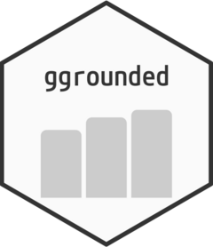
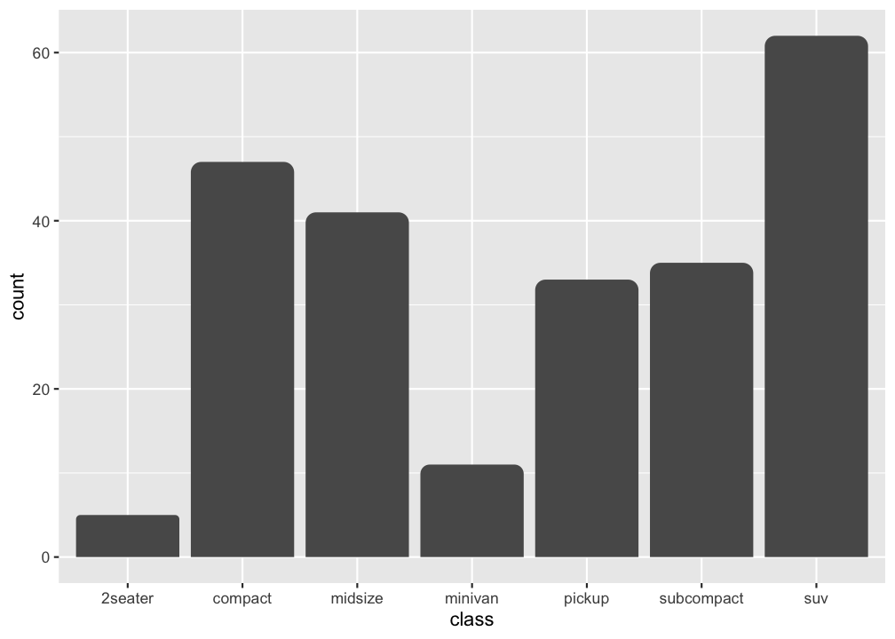
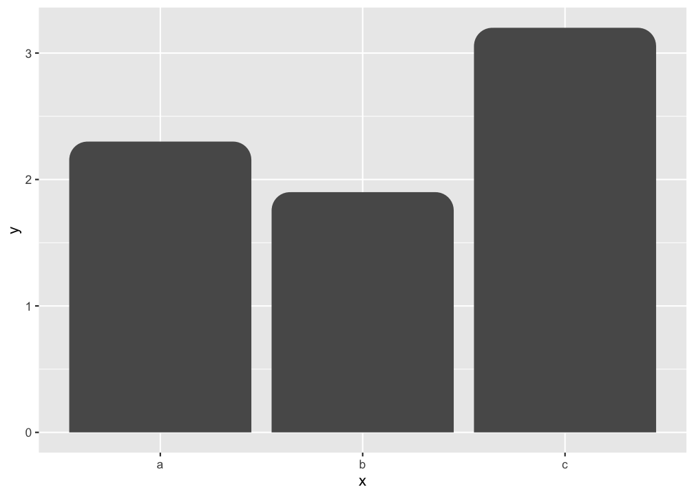

<!-- README.md is generated from README.Rmd. Please edit that file -->

# ggrounded <a href="https://botan.github.io/ggrounded/"></a>

<!-- badges: start -->

[](https://lifecycle.r-lib.org/articles/stages.html#experimental)
[](https://github.com/botan/ggrounded/actions/workflows/R-CMD-check.yaml)
[](https://app.codecov.io/gh/botan/ggrounded?branch=main)
[](https://CRAN.R-project.org/package=ggrounded)
<!-- badges: end -->

A mini-package for creating bar plots with rounded corners using
ggplot2.

## Installation

Install the released version of ggrounded from CRAN:

``` r
install.packages("ggrounded")
```

Or install the development version from GitHub with:

``` r
# install.packages("pak")
pak::pak("botan/ggrounded")
```

## Usage

There are two types of bar charts in ggplot2: `geom_bar()` and
`geom_col()`. `geom_bar_rounded()` and `geom_col_rounded()` are wrappers
on them for rounding the top corners. `geom_bar_rounded()` makes the
height of the bar proportional to the number of cases in each group (or
if the `weight` aesthetic is supplied, the sum of the weights).

``` r
library(ggrounded)
library(ggplot2)

ggplot(mpg, aes(class)) +
  geom_bar_rounded()
```



If you want the heights of the bars to represent values in the data, use
`geom_col_rounded()` instead.

``` r
ggplot(data.frame(x = letters[1:3], y = c(2.3, 1.9, 3.2)), aes(x, y)) +
  geom_col_rounded()
```



## Code of Conduct

Please note that the ggrounded is released with a [contributor code of
conduct](https://www.contributor-covenant.org/version/2/1/code_of_conduct.html).
By contributing in this project you agree to abide by its terms.

## License

This package is released under the MIT License.
