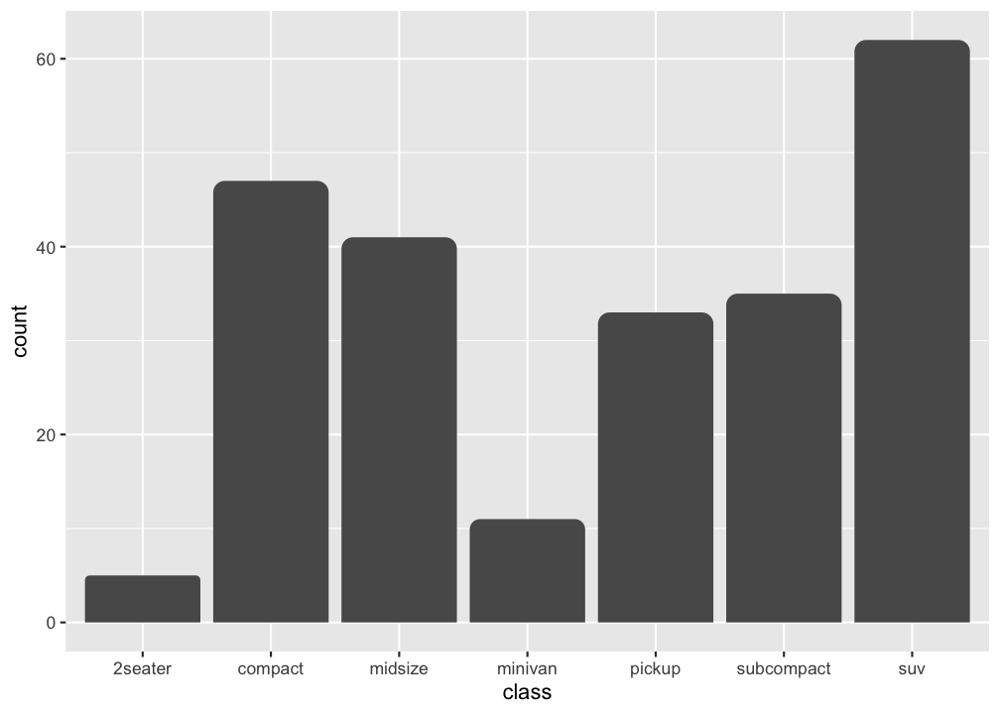
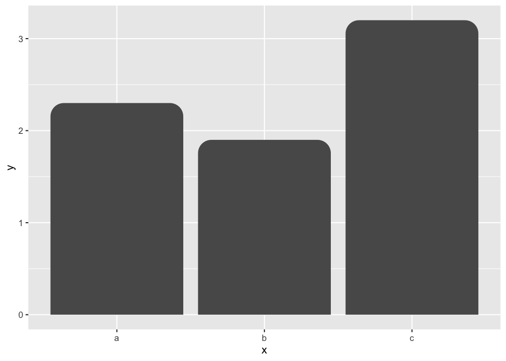
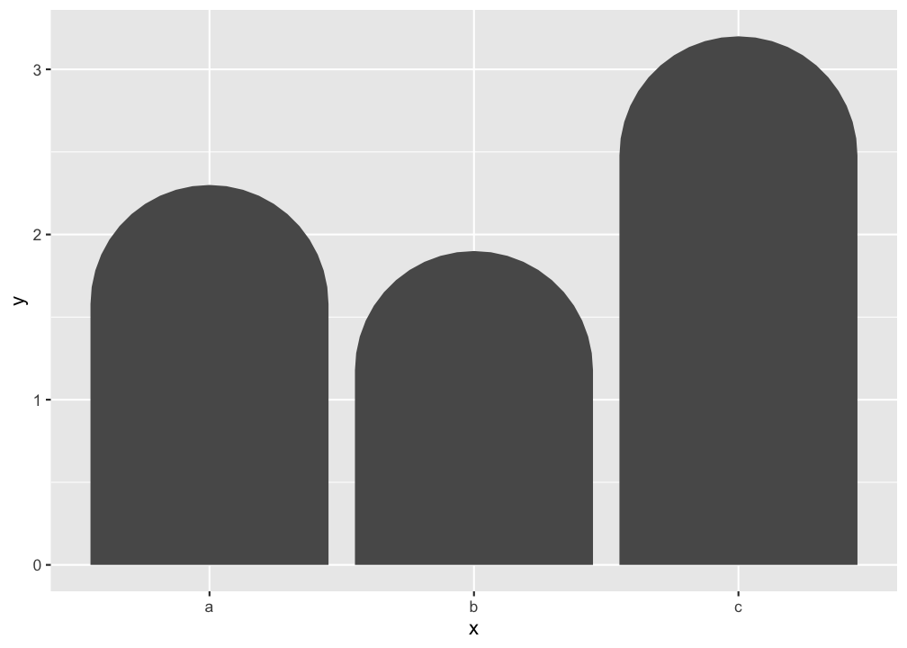
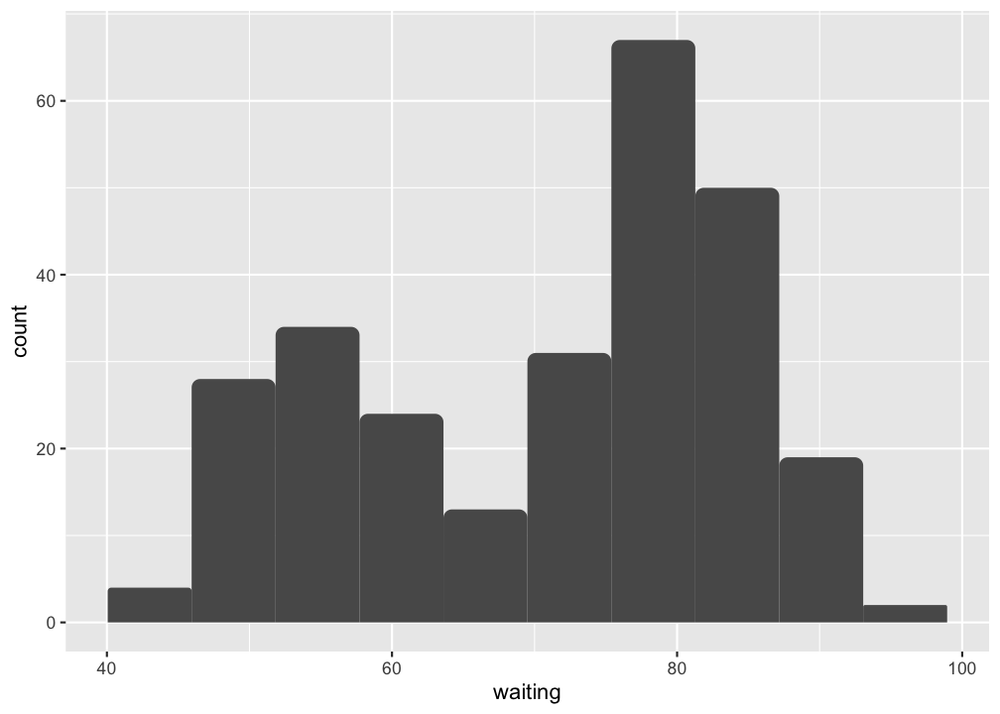
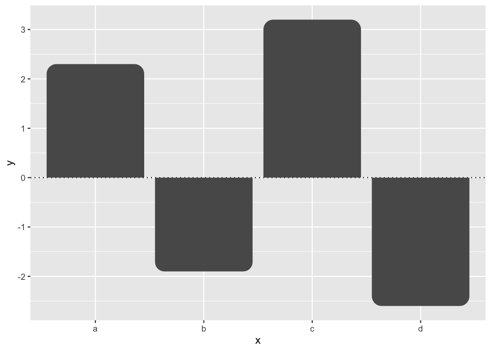
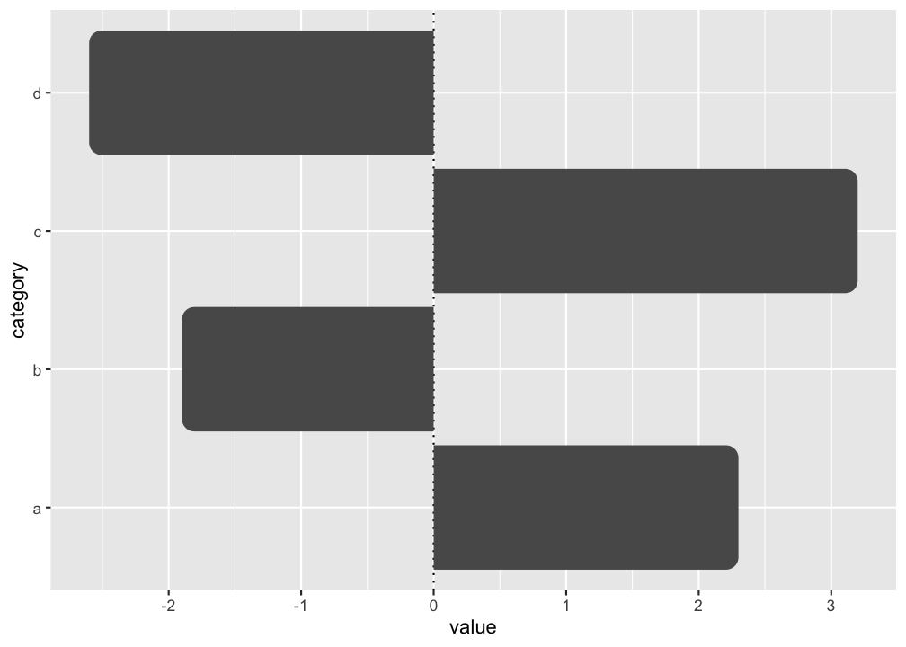

# ggrounded

ggrounded creates bar plots with rounded corners using ggplot2.

## Installation

Install the released version of ggrounded from CRAN:

``` r
install.packages("ggrounded")
```

Or install the development version from GitHub with:

``` r
# install.packages("pak")
pak::pak("botan/ggrounded")
```

## Usage

There are two types of bar charts in ggplot2:
[`geom_bar()`](https://ggplot2.tidyverse.org/reference/geom_bar.html)
and
[`geom_col()`](https://ggplot2.tidyverse.org/reference/geom_bar.html).
[`geom_bar_rounded()`](https://botan.github.io/ggrounded/reference/geom_col_rounded.md)
and
[`geom_col_rounded()`](https://botan.github.io/ggrounded/reference/geom_col_rounded.md)
are wrappers on them for rounding the top corners.
[`geom_bar_rounded()`](https://botan.github.io/ggrounded/reference/geom_col_rounded.md)
makes the height of the bar proportional to the number of cases in each
group (or if the `weight` aesthetic is supplied, the sum of the
weights).

The `radius` argument is a normalized value between `0` and `1`. Use `0`
for square corners and `1` for the maximum rounding that each bar can
safely support based on its own width and height.

``` r
library(ggrounded)
library(ggplot2)

ggplot(mpg, aes(class)) +
  geom_bar_rounded()
```



If you want the heights of the bars to represent values in the data, use
[`geom_col_rounded()`](https://botan.github.io/ggrounded/reference/geom_col_rounded.md)
instead.

``` r
ggplot(data.frame(x = letters[1:3], y = c(2.3, 1.9, 3.2)), aes(x, y)) +
  geom_col_rounded()
```



Use larger `radius` values when you want a more pronounced rounded top:

``` r
ggplot(data.frame(x = letters[1:3], y = c(2.3, 1.9, 3.2)), aes(x, y)) +
  geom_col_rounded(radius = 1)
```



Histograms can use rounded bins with
[`geom_histogram_rounded()`](https://botan.github.io/ggrounded/reference/geom_histogram_rounded.md):

``` r
ggplot(faithful, aes(waiting)) +
  geom_histogram_rounded(bins = 10)
```



Negative values are supported too. Bars above zero keep rounded top
corners, while bars below zero round away from the baseline:

``` r
ggplot(data.frame(x = letters[1:4], y = c(2.3, -1.9, 3.2, -2.6)), aes(x, y)) +
  geom_hline(yintercept = 0, linetype = "dotted") +
  geom_col_rounded()
```



Horizontal bars are supported as well. In horizontal layouts, rounding
follows the terminal bar edge rather than the baseline:

``` r
ggplot(
  data.frame(category = letters[1:4], value = c(2.3, -1.9, 3.2, -2.6)),
  aes(value, category)
) +
  geom_vline(xintercept = 0, linetype = "dotted") +
  geom_col_rounded()
```



## Code of Conduct

Please note that the ggrounded is released with a [contributor code of
conduct](https://www.contributor-covenant.org/version/2/1/code_of_conduct.html).
By contributing in this project you agree to abide by its terms.

## License

This package is released under the MIT License.
